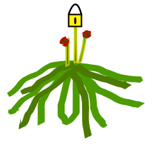

# Welwitschi-Auth

|master|develop|
|:----:|:-----:|
|||

Welwitschi-Auth is an authentication library for use in websites written in
PHP. It offers an object-oriented abstraction over rows stored in a
MySQL/MariaDB database.

Accounts created by this library all receive a unique ID in the database.
Usernames and email addresses are also unique, it is not possible to have
duplicate entries.

Upon creation of an account, the account will need to be confirmed before
being able to log in or generate API keys.

A user is able to log in with exactly one device at a time, as well as have
one active API token.

## Security

Passwords, API Tokens and Login Tokens are all stored salted and hashed
using the builtin `password_hash()` function. The algorithm used to hash the
password is `PASSWORD_BCRYPT`.

All SQL Statements with variable values are properly escaped to avoid SQL
injection.

Usernames and Email addresses are sanitized using html `htmlspecialchars` to
avoid Cross-Site-Scripting attacks (XSS).

## Installation

You can use welwitschi-auth by adding the requirement

    "namboy94/welwitschi-auth": "dev-master"
    
to your `composer.json` file an then running `composer install`. You can then
find the classes in `vendor/namboy94/welwitschi-auth/src`. Thanks to
autoloader, you should be able to easily access the classes from cheetah-bets.

## Documentation

All classes and methods are documented using DocBlock comments. Additional
Documentation can be found in [doc](doc/).

## Further Information

* [Changelog](CHANGELOG)
* [License (GPLv3)](LICENSE)
* [Gitlab](https://gitlab.namibsun.net/namibsun/php/welwitschi-auth)
* [Github](https://github.com/namboy94/welwitschi-auth)
* [Progstats](https://progstats.namibsun.net/projects/welwitschi-auth)
* [Packagist Page](https://packagist.org/packages/namboy94/welwitschi-auth)